[Português](README.md)

## Hello, i'm Vitor! 👋

This is my GitHub profile, here is where i store all my projects and activities I do at college, some of these projects are public, and you can take a look if you want ;)

---
   and etc...
---

---

---
 	 

---

## 🚀 About Me

- 💻 Java Developer, and I like to tamper with libGDX.
- 🏫 I'm currently studyng Software Development and System Analysis at FIAP - São Paulo.

---

## 🛠️ Technical Abilities

### Programming Languages
- **Java** - Varius projects, backend.
- **Javascript** - NodeJS.
- **SQL** - Databases, Modelagem.

### Tools & Tecnologies
- Git & GitHub
- REST APIs
- SQL/Databases

